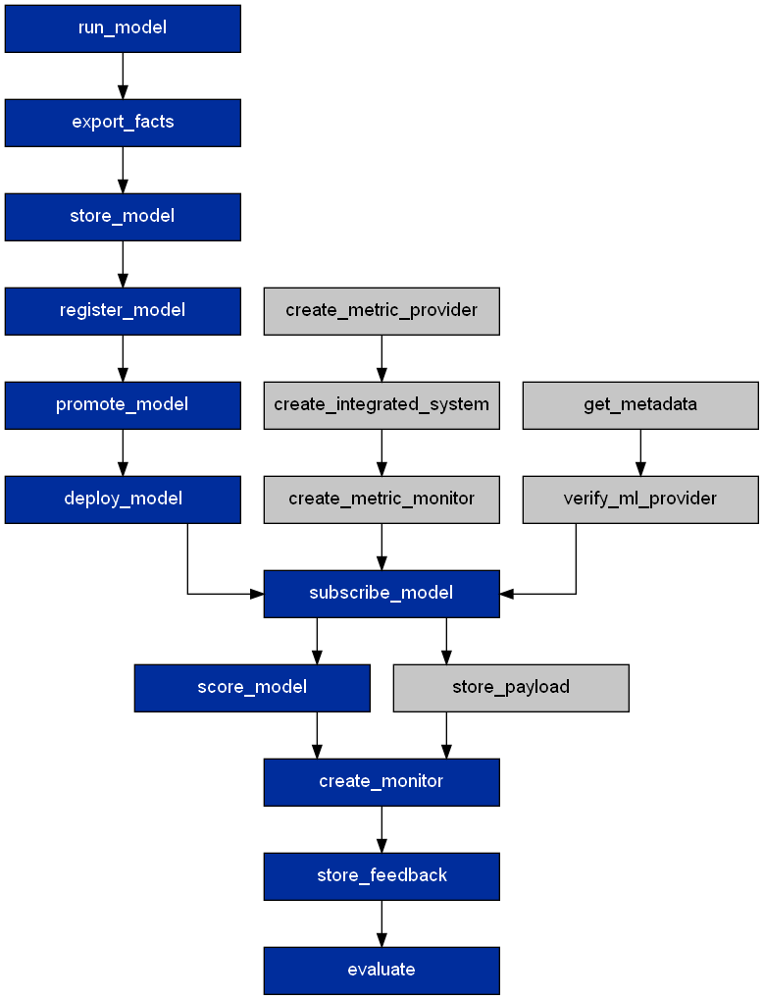
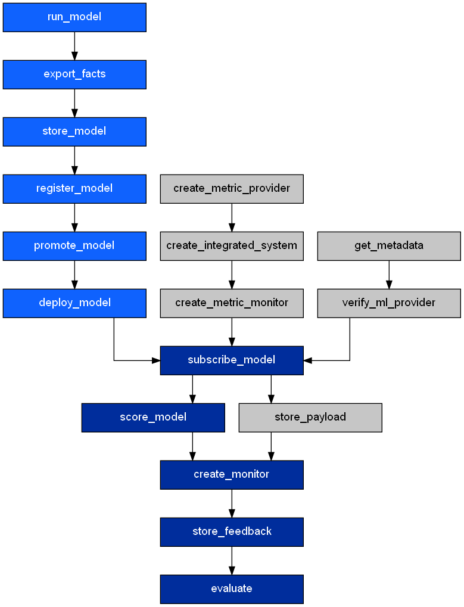
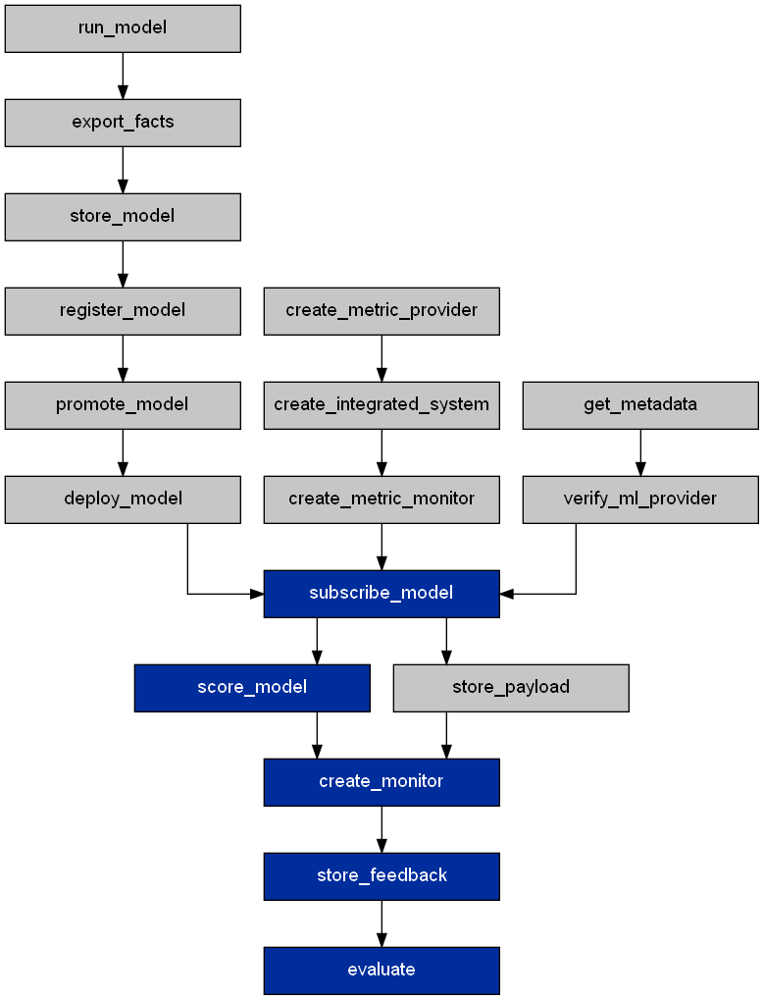

.. _dependency-graph:

Dependency Graph
================

The dependency graph is made up of APIs from various Cloud Pak for Data modules (`Watson Machine Learning <https://wml-api-pyclient.mybluemix.net/>`_, `Watson OpenScale <https://https://ibm-watson-openscale-client.mybluemix.net//>`_, `AI Gov Facts <https://ibm-aigov-facts-client.mybluemix.net//>`_ and `IBM Data APIs <https://cloud.ibm.com/docs?tab=api-docs>`_).

Each node in the graph represents a logical operation where the dependencies are its predecessor nodes.

.. image:: _static/graph.png
   :alt: Graph

Execution Paths
~~~~~~~~~~~~~~~

cpdflow generates 2 types of execution paths, namely forward path and backward path, to ensure declarative idempotent operations.

.. _forward-path:

Forward Path
~~~~~~~~~~~~

The steps necessary to achieve the final state of the model lifecycle stage. 

For example to validate the ``German Credit Risk-GBC`` model on Watson OpenScale environment, using CLI::

   cpdflow validate -c config.json -m "German Credit Risk-GBC"

or, using Python::

   cpdflow.validate(config=config, model_names=["German Credit Risk-GBC"])

The forward execution path looks like this for a Watson Machine Learning model,

.. And for an external Machine Learning model (such as SageMaker model, Azure ML model, etc.),

.. .. image:: _static/graph-custom-forward.png
..    :alt: Forward execution path for external model

The user just needs to specify the model details in the :ref:`configuration file <config-file>` and cpdflow handles the rest.
     
Before running the forward execution path, cpdflow runs a dependency check on each predecessor node to ensure the required dependencies are met.

To evaluate a Watson Machine Learning model, it needs to be promoted to a deployment space and deployed. 

cpdflow splits the forward execution path into two phases, requirements checking phase and forward phase.

Each node in the requirement checking phase, ensures that the prerequisites are met for the downstream operations. 
If they are not met, these operations are queued into the execution path. 
The actual execution of these operations depends on whether the ``update`` or ``overwrite`` paramaters is defined in the :ref:`configuration file <config-file>`.

.. _backward-path:

Backward Path
~~~~~~~~~~~~~

The steps necessary to remove and clean up downstream assets that have been created earlier.

To remove the ``German Credit Risk-GBC`` model from the validation lifecycle, using the CLI::

   cpdflow validate -c config.json

or, using Python::

   cpdflow.validate(config=config, model_names=[])

Remember that cpdflow is based on a declarative approach and the above commands are delcaring that nothing should be in the validate lifecycle.

Thus cpdflow generates the necessary steps to remove the models from the validate lifecycle.

The backward execution path looks like this,

Not all nodes in the backward execution path will have a graph operation attached to it. 
In this case, only ``create_monitor`` and ``subscribe`` have graph operations that will remove the monitors created by this subscription and the subscription itself respectively.

Removing the ``German Credit Risk-GBC`` model from the develop lifecycle will have a very different backward execution path, using the CLI::

   cpdflow develop -c config.json

or, using Python::

   cpdflow.develop(config=config, model_names=[])

As the develop lifecycle stage consist of the root node, ``run_model``, removing the root node will remove the entire tree as its decendents depends on assets from the root node.

In this case, removing the model will mean removing its deployment and its monitoring subscriptions.

