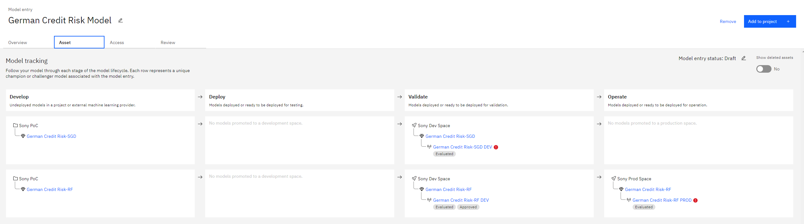

.. |br| raw:: html

    

.. _lifecycle-stages:

Lifecycle Stages
================

The model lifecycle stages (`Factsheets Model Inventory <https://dataplatform.cloud.ibm.com/docs/content/wsj/analyze-data/factsheets-model-inventory.html>`_) are,

**1. Develop (Watson Studio)**  

In the develop stage, Data Scientists train and tune different types of models to solve a specific business problem. The selected few models are then stored in the Model Inventory for governance and tracking.
|br|
|br|

**2. Deploy (Watson Machine Learning)**

In the deploy stage, MLOps Engineers deploy the trained model in the development environment for further testing.
|br|
|br|

**3. Validate (Watson OpenScale development environment)**

In the validate stage, Model Validators evaluate the models and ensures that business requirements (such as fairness, explainability, etc.) and technical requirements (such as accuracy, f1 score, etc.) are met. 
|br|
|br|

**4. Operate (Watson OpenScale production environment)**

In the operate stage, models that are approved by the Model Validator are deployed to production by MLOps Engineers for monitoring.

An example of tracking the model lifecycle using Model Inventory and AI Factsheets.

