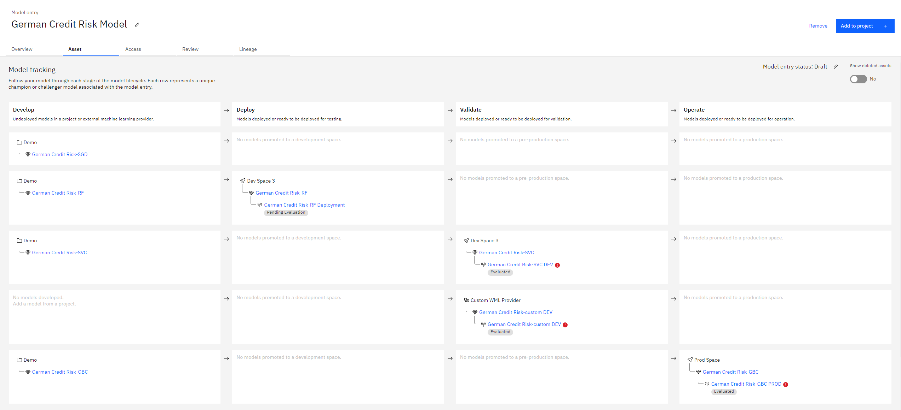

Usage
=====

After defining the :ref:`configuration file <config-file>` with the necessary credential and model details, consider the following scenario.

A data scientist is working on 5 models,

1. ``German Credit Risk-SGD`` - Stochastic gradient descent classifer
2. ``German Credit Risk-RF`` - Random forest classifer
3. ``German Credit Risk-SVC`` - Support vector classifer
4. ``German Credit Risk-custom`` - Custom ML model hosted externally
5. ``German Credit Risk-GBC`` - Gradient boosting classifer

Assume the following tasks,

- Store ``German Credit Risk-SGD`` in the project space

- Deploy ``German Credit Risk-RF`` to the development space

- Validate ``German Credit Risk-SVC`` and ``German Credit Risk-custom`` in the development enviroment

- Operate ``German Credit Risk-GBC`` in the production enviroment

The above tasks can be easily achieved by either the CLI or Python API using the below commands,

Using the CLI
-------------
.. code-block:: bash

   # store model in project space
   cpdflow apply develop -c config.json -m "German Credit Risk-SGD"
   `  `

   # deploy model in development space
   cpdflow apply deploy -c config.json -m "German Credit Risk-RF" -s "dev"

   # validate model in development space
   cpdflow apply validate -c config.json -m "German Credit Risk-SVC" -m "German Credit Risk-custom"

   # operate model in production space
   cpdflow apply operate -c config.json -m "German Credit Risk-GBC"

Using the Python API
--------------------
.. code-block:: python

   import cpdflow

   config = {} # define the configuration file, refer to the configuration file documentation

   # store model in project space
   cpdflow.apply.develop(config=config, model_names=["German Credit Risk-SGD"])

   # deploy model in development space
   cpdflow.apply.deploy(config=config, model_names=["German Credit Risk-RF"], space_type="dev")

   # validate model in development space
   cpdflow.apply.validate(config=config, model_names=["German Credit Risk-SVC", "German Credit Risk-custom"])

   # operate model in production space
   cpdflow.apply.operate(config=config, model_names=["German Credit Risk-GBC"])

Below is the the final output in Model Inventory.

